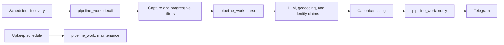

# Shoberfredy

Shoberfredy is a private, single-user homeserver application for finding
German rental listings, one job per search, any number of cities. It
discovers listings from ImmoScout24, Kleinanzeigen, and WG-Gesucht,
extracts structured facts with an LLM, deduplicates across portals and cities,
and sends accepted listings to Telegram.

It began as a fork of [Fredy](https://github.com/orangecoding/fredy) by
Christian Kellner (orangecoding) and keeps his copyright notice at the head of
every source file. The two have since diverged completely — the pipeline,
schema and deployment here are not upstream's — so
this repository is developed and released on its own. See [LICENSE](LICENSE) for
the terms, which include an attribution clause; the notices are required, not
decorative.

This README is the only document in the repository. Anything that needed saying
beside the code is said here instead.

## Three levels

One central pipeline serves many providers and many jobs, and each job is
fully self-describing. There are exactly three levels, and configuration
lives at exactly one of them:

| Level              | Holds                                                                                               | Configurable?  |
| ------------------ | --------------------------------------------------------------------------------------------------- | -------------- |
| **Deployment**     | secrets, kill switches, timeouts, and every other tuning knob (`env`); `sqlitepath` (`config.json`) | yes            |
| **Portal adapter** | how to read one site: selectors, `normalize`, `captureDetails`, pagination                          | no — code only |
| **Job**            | everything about one search: city, cadence, filters, providers, notification                        | yes            |

A portal adapter (`lib/provider/*.js`) never carries per-job state. Its
`init(sourceConfig)` is a pure builder: it returns a fresh config object
carrying that job's URL, so two jobs discovering the same portal concurrently
never see each other's search. Nothing about one job's configuration is
stored where another job's code would read it — the same principle that keeps
one job's blacklist from leaking into another's, applied to the adapter layer
too.

## Architecture



Discovery cadence is each job's own — `interval` and `workingHours` live on the
job document, not on one deployment-wide setting. One central scheduler ticks
every `FREDY_SCHEDULER_TICK_MS` and checks due-ness per `(job, provider)` pair
against a persisted `job_provider_schedule` row, so a restart does not
stampede every pair into running at once. Same-cadence jobs land at different
minutes: each pair gets a deterministic phase offset from a hash of its own
`(job, provider)` key, modulo its interval. A provider is one lane — at most
one discovery in flight per portal, plus a minimum gap
(`FREDY_DISCOVERY_MIN_PORTAL_GAP_MS`) between consecutive hits of it — while
different portals run concurrently under a global cap
(`FREDY_DISCOVERY_CONCURRENCY`). A pair that slips past several due windows
while waiting for a lane still only runs once, not once per window missed.

Detail capture, parsing, notification, and database upkeep are work kinds in
one durable queue. Each item has one shared lease, retry, terminal-state, and
audit contract. Process restarts reclaim expired work rather than running
repair scripts. Dedupe and filtering are pipeline stages, not maintenance
commands.

Retry budgets exist only where retry is the sole recovery path. Discovery has
none — a failed run waits for the next interval. `maintenance` gets one attempt
per scheduled pass. Availability probes do not exist. `detail`, `parse` and `notify` keep real
budgets: an unchanged card is only touched rather than reset, and a notification
is keyed forever, so nothing else would bring them back.

### One advert, one extraction, one verdict per job

Work is keyed by advert, not by (job, advert). Three searches that all find the
same flat meet at the same `pipeline_work` row, so it is fetched once and given
to the LLM once. What differs per job is the _verdict_, and that is a row in
`listing_verdicts` — so a flat inside one search's polygon and outside another's
is accepted by the first and rejected by the second, without either one hiding
or reviving the listing on the other's behalf.

Every stage asks the same question before it spends anything: has this advert
already been decided, under this job's configuration, on evidence that has not
changed? The answer is stored against the advert's identity claims and is
consulted at discovery, at detail capture, before the LLM call, and before
notification.

Filtering is deliberately uneven, because the stages differ in what they cost:

| Stage      | Filters on                                                                | Costs        |
| ---------- | ------------------------------------------------------------------------- | ------------ |
| Card       | The job's blacklist and specification, over what the card states          | nothing      |
| Extraction | The job's intent filter and specification, and geography from the address | one LLM call |

The two lists are different kinds of thing and both belong to the job. The
blacklist is free text and only ever read at the card stage, where free text is
all there is. The intent filter is codes from a closed vocabulary — `swap`,
`wg_room`, `sublet`, `furnished`, `relisting_platform`, `fixed_term` — read only
after extraction, against validated enum fields the model already filled in.

There is still no text matching after extraction. The model answers "is this a
swap, a sublet, a WG room, furnished, fixed-term?" directly, and grepping the
page for the same thing asks twice and believes the worse answer. What changed is
that the answer is compared against a list the job owns rather than inferred from
whichever words happened to be in one deployment-wide blacklist: a search for a
WG room and a search for a whole flat want opposite verdicts on the same field,
and one list cannot hold both.

An advert refused at the card stage never becomes a listing. It is recorded in
`source_rejections` together with the claims that identify it, which is what
stops it being fetched and refused again on the next capture whose page text
differs.

Geography is decided exactly once, after extraction, from the address the model
read. Roughly a third of geocodes resolve only to a district or postcode
centroid, so a polygon decision is accurate to a neighbourhood rather than a
building. That is accepted deliberately: the alternative is guessing from the
scraped card, which is worse evidence for the same answer.

A job with no `spatialFilter` has no area limit, and then the geography of a
listing decides nothing about its verdict — the polygon test and the
`no_coordinates` refusal are both skipped rather than passed.

### One city, one market

Adverts routinely give a street and no city, and a German street name matches in
a hundred towns. So a job names the city it searches. That city anchors the
geocoder's fallback candidates and, folded to a stable key such as `München` to
`muenchen`, isolates provider backoff and listing identity across cities.

A listing's market is read from the locality the geocoder returned, not from the
job that found it, because a Munich search can still surface a flat one town
over. Without a returned locality, the job city anchors the market; without either, it stays null. This geographic
key is listing data; it is not a price score.

## Data policy

The schema uses ordered, append-only migrations. `100.current-schema.js` is the
unchanged historical baseline; `101.archive-and-event-history.js` retires listing
availability and adds durable event history. Migration 102 indexes stored-image
paths and notification ownership for maintenance and ad hoc queries. Applied checksums are immutable,
with one transition exception: known historical checksums of the previously
mutable migration 100 may advance through the frozen baseline's existing upgrade
logic when it is the sole ledger entry. The schema changes, replacement ledger
entry and audit of the previous entry commit together before migration 101 runs.
Unknown checksums, a modified frozen baseline, or checksum changes after later
migrations have been recorded still stop startup. This transition does not restore
upgrade paths removed before the frozen baseline. Subsequent schema changes belong
in a new migration.

Listings are an archive of captured adverts. There is no active/gone status,
no scheduled visit to old advert pages, and no claim that an archived advert is
still available. `last_seen_at` records observations during ordinary discovery
and capture. A newly queued detail request may still report that its source is
unavailable; that outcome is an audit fact, not a listing status.

The upgrade archives previous availability fields as audit events and cancels
pending availability probes. Formerly gone adverts remain suppressed for their
existing jobs, preventing a historical notification wave when the flag disappears.
It does not replay terminal failures, reparse historical extractions, or resend
unverifiable deliveries.

| Data                                              | Purpose and retention                                                                                                                                                                        |
| ------------------------------------------------- | -------------------------------------------------------------------------------------------------------------------------------------------------------------------------------------------- |
| `listings`, `listing_attributes`, `listing_texts` | Canonical facts, extraction provenance and one richest full-text capture per advert.                                                                                                         |
| `listing_verdicts`, `source_rejections`           | Per-job decisions; early card refusals do not become canonical listings.                                                                                                                     |
| `listing_claims`, `source_identity_keys`          | Indexed advert identities and source matching, without whole-table JSON scans.                                                                                                               |
| `listing_sources`, `listing_source_observations`  | Source URLs, ownership, unique content hashes, byte counts and observation times; not copies of every raw HTML page.                                                                         |
| `pipeline_work`, `pipeline_audit_events`          | Durable work and its claims, retries, outcomes, decisions, merges and cancellations. Terminal payloads are compacted except failed parse captures; work rows and audit history are retained. |
| `runtime_events`                                  | Application logs and named events with credential redaction. Job/settings changes record operation and identity, excluding secret values.                                                    |
| `discovery_run_audit`                             | Every finished/skipped source search, rather than an overwritten last-run report.                                                                                                            |
| `llm_call_audit`                                  | Request/response bodies, model, timing, provider usage/cost when supplied, HTTP outcomes, hashes and extraction-validation results. Historical bodies are not fabricated.                    |
| `geocode_call_audit`                              | Every HTTP candidate, accepted result/precision, provider status, timing, errors and owning queue item. Cache hits and deferrals are runtime events.                                         |
| `notification_receipts`                           | Actual per-chat Telegram message IDs, used to avoid resending to successful recipients during a partial retry.                                                                               |
| `notification_suppressions`                       | Intentional non-delivery and its reason, separate from successful delivery.                                                                                                                  |
| `homeserver_geocode_cache`                        | City-scoped results; unreachable legacy unscoped rows move into event history. `attempts` counts cache writes, not HTTP calls.                                                               |

Canonical facts, claims, per-job decisions and notification enqueueing commit
together. `notified_at` records successful delivery. Historical timestamps without
a matching successful work record become explicit unverified suppressions.
Existing successful work records remain evidence; they acquire no invented
Telegram message IDs. Telegram and SQLite cannot commit atomically: a crash after
Telegram accepts a message but before its receipt is stored can still duplicate it.

Images are content-addressed WebP files capped at 20 KB. Downloads stream with a
25 MiB ceiling, decoded input is capped at 16 million pixels, and one image is
processed at a time. The detail browser closes before image processing; encoding
reuses resized pixels. These bounds reduce peaks without changing host limits.
Upkeep removes unreferenced files older than 24 hours and marks missing image
references in SQLite. It neither visits old adverts nor redownloads their images.
Referenced media has no application age-based expiry.

Events and terminal work rows have no automatic age-based deletion. This
intentionally allows database growth. Successful extraction provenance retains
the supplied system/evidence input as well as the structured output. Optional
`FREDY_DB_VACUUM=1` lets scheduled upkeep return unused SQLite pages to disk.

## Docker

```bash
docker run -d --name shoberfredy \
  --env-file .env.local \
  -v shoberfredy_conf:/conf \
  -v shoberfredy_db:/db \
  -p 9998:9998 \
  ghcr.io/jhytabest/shoberfredy:main
```

The only HTTP surface is Docker's minimal `/health` endpoint on
`FREDY_HEALTH_PORT` (default `9998`). It responds with `ok` if the process can run
`SELECT 1`, otherwise HTTP 503. There are no worker heartbeats, service counters,
provider dashboards, integrity sweeps, alerts or custom monitoring endpoints.
Scheduling, circuit breakers, deadlines and retry backoff remain execution controls.
Event history lives in SQLite for ad hoc analysis. External Docker/Ansible
configuration belongs to the host repository; this application change does not
edit or deploy it.

The image runs as UID/GID `10001`; the supplied Compose file also uses a
read-only root filesystem, drops Linux capabilities, and enables
`no-new-privileges`.

The database lives at `/db/listings.db` and content-addressed media at
`/db/media`. Both belong to the persistent application volume. The host must not
age-prune this directory: it cannot distinguish referenced images from orphans.
Image expiry belongs to the application. Removing a host pruning rule prevents
further deletions but cannot restore files already removed. SQLite files are private to the application user.
Absolute `sqlitepath` values are honored directly; relative paths resolve from
the application directory. Local development can use `{"sqlitepath":"db"}`.

### Required secrets

Place these in `.env.local`:

```dotenv
OPENROUTER_API_KEY=...
GOOGLE_GEOCODING_API_KEY=...
```

The application also reads `/conf/config.json`; its only deployment-level
setting is the SQLite directory:

```json
{ "sqlitepath": "/db" }
```

## Runtime controls

Every environment variable the application reads is declared in
`lib/shared/env.js`. Reading an undeclared name throws, so nothing is read
outside that registry — but the table below is hand-maintained alongside it,
not generated from it; keep the two in sync when the registry changes.

#### Credentials

| Variable                   | Default   | Purpose                                   |
| -------------------------- | --------- | ----------------------------------------- |
| `GOOGLE_GEOCODING_API_KEY` | `(unset)` | Google Geocoding key.                     |
| `OPENROUTER_API_KEY`       | `(unset)` | OpenRouter key; required for LLM parsing. |

#### Kill switches

| Variable                     | Default | Purpose                                            |
| ---------------------------- | ------- | -------------------------------------------------- |
| `FREDY_DETAIL_FETCH_ENABLED` | `true`  | Set 0 to stop draining detail work.                |
| `FREDY_LLM_ENABLED`          | `true`  | Set 0 to disable the LLM entirely (parsing stops). |
| `FREDY_MAINTENANCE_ENABLED`  | `true`  | Set 0 to stop scheduled maintenance work items.    |
| `FREDY_NOTIFICATION_ENABLED` | `true`  | Set 0 to stop notification delivery.               |
| `FREDY_PARSER_ENABLED`       | `true`  | Set 0 to stop the LLM parser worker.               |

#### Discovery scheduler

| Variable                            | Default  | Purpose                                                                                                                 |
| ----------------------------------- | -------- | ----------------------------------------------------------------------------------------------------------------------- |
| `FREDY_SCHEDULER_TICK_MS`           | `15000`  | How often the scheduler checks for due jobs.                                                                            |
| `FREDY_DISCOVERY_CONCURRENCY`       | `3`      | Global cap on discovery runs in flight at once, across all portals.                                                     |
| `FREDY_DISCOVERY_MIN_PORTAL_GAP_MS` | `5000`   | Minimum gap between consecutive discovery hits of the same portal, across jobs.                                         |
| `FREDY_DISCOVERY_MAX_PAGES`         | `20`     | Deployment-wide page-ceiling override, under a job's own `provider[].maxPages`; unset uses the adapter's own limit (3). |
| `FREDY_DISCOVERY_TIMEOUT_MS`        | `120000` | Deadline for one provider discovery run.                                                                                |
| `FREDY_HEALTH_PORT`                 | `9998`   | Port for the `/health` HTTP server; read once at startup.                                                               |

#### The work queue

| Variable                             | Default    | Purpose                                                         |
| ------------------------------------ | ---------- | --------------------------------------------------------------- |
| `FREDY_DETAIL_ITEM_TIMEOUT_MS`       | `300000`   | Deadline for one detail capture.                                |
| `FREDY_DETAIL_MAX_FAILURES`          | `8`        | Attempts before a detail item is abandoned.                     |
| `FREDY_PARSER_ITEM_TIMEOUT_MS`       | `300000`   | Deadline for one parse (text + repair).                         |
| `FREDY_PARSER_MAX_ITEM_FAILURES`     | `8`        | Attempts before a parse item is abandoned.                      |
| `FREDY_NOTIFICATION_ITEM_TIMEOUT_MS` | `120000`   | Deadline for one notification digest.                           |
| `FREDY_NOTIFICATION_BATCH_SIZE`      | `50`       | Deliveries considered for one digest.                           |
| `FREDY_MAINTENANCE_ITEM_TIMEOUT_MS`  | `1800000`  | Deadline for automatic database upkeep.                         |
| `FREDY_WORK_IDLE_POLL_MS`            | `1000`     | Idle sleep between empty work-queue polls.                      |
| `FREDY_WORK_MAX_BACKOFF_MS`          | `900000`   | Ceiling on retry and park backoff for work items.               |
| `FREDY_WORK_MAX_DEFERRALS`           | `24`       | Parks on a resource before work is abandoned.                   |
| `FREDY_WORK_MAX_PARK_MS`             | `86400000` | Age at which parked work is abandoned regardless of park count. |
| `FREDY_NOTIFY_MAX_FAILURES`          | `6`        | Attempts before a notification is abandoned.                    |
| `FREDY_WORKER_RESTART_DELAY_MS`      | `5000`     | Delay before restarting a crashed worker loop.                  |

#### LLM

| Variable                               | Default  | Purpose                                                  |
| -------------------------------------- | -------- | -------------------------------------------------------- |
| `FREDY_LLM_DAILY_LIMIT`                | `1000`   | Daily LLM request budget (UTC days).                     |
| `FREDY_LLM_MAX_EMBEDDED_CHARS`         | `24000`  | Cap on embedded JSON sent to the LLM.                    |
| `FREDY_LLM_MAX_LISTING_FAILURES`       | `5`      | LLM attempts before a listing is abandoned.              |
| `FREDY_LLM_MAX_TEXT_CHARS`             | `24000`  | Cap on captured page text sent to the LLM.               |
| `FREDY_LLM_REQUEST_TIMEOUT_MS`         | `120000` | Deadline for a single LLM request.                       |
| `FREDY_LLM_TEXT_MODEL`                 | _unset_  | OpenRouter model id for text extraction.                 |
| `FREDY_LLM_UPSTREAM_BACKOFF_MS`        | `60000`  | Initial pause after an upstream LLM request failure.     |
| `FREDY_LLM_UPSTREAM_MAX_BACKOFF_MS`    | `900000` | Maximum per-model pause after repeated request failures. |
| `FREDY_OPENROUTER_REQUESTS_PER_MINUTE` | `18`     | Client-side OpenRouter rate limit.                       |

#### Filters and geocoding

| Variable                                 | Default | Purpose                                                                                  |
| ---------------------------------------- | ------- | ---------------------------------------------------------------------------------------- |
| `FREDY_GEOCODER_RETRY_COARSE_AFTER_DAYS` | `14`    | Age at which a coarse geocode retries.                                                   |
| `FREDY_CARD_FILTER_AUDIT_RATE`           | `0.03`  | Fraction of card-stage refusals let through to extraction so the refusal can be checked. |

#### Provider circuit breaker

| Variable                                 | Default    | Purpose                                                                           |
| ---------------------------------------- | ---------- | --------------------------------------------------------------------------------- |
| `FREDY_PROVIDER_BREAKER_COOLDOWN_MS`     | `1800000`  | Initial provider pause duration.                                                  |
| `FREDY_PROVIDER_BREAKER_FAILURES`        | `2`        | Failed discovery runs before a provider is paused.                                |
| `FREDY_PROVIDER_BREAKER_ITEM_CHALLENGES` | `8`        | Challenged single requests, with no success between, before a provider is paused. |
| `FREDY_PROVIDER_BREAKER_MAX_COOLDOWN_MS` | `21600000` | Ceiling on provider pause.                                                        |

#### Maintenance

| Variable                        | Default    | Purpose                                       |
| ------------------------------- | ---------- | --------------------------------------------- |
| `FREDY_DB_VACUUM`               | `false`    | Set 1 to VACUUM during scheduled maintenance. |
| `FREDY_MAINTENANCE_INTERVAL_MS` | `86400000` | Spacing between maintenance work items.       |

#### Runtime and tooling

| Variable                   | Default       | Purpose                                                   |
| -------------------------- | ------------- | --------------------------------------------------------- |
| `CLOAKBROWSER_BINARY_PATH` | _unset_       | Explicit CloakBrowser Chromium path.                      |
| `CLOAKBROWSER_CACHE_DIR`   | _unset_       | CloakBrowser download cache directory.                    |
| `FREDY_DOCKER`             | `false`       | Set by the container image to signal a Docker deployment. |
| `NODE_ENV`                 | `development` | Node environment; "production" quiets debug logging.      |

## Local development

Node.js 22 or newer is required.

```bash
yarn install
yarn start:backend
```

Quality checks:

```bash
yarn format:check
yarn lint
```

CI checks the application, builds the Docker image, starts it through the real
migration path, and requires a healthy `/health` response before publishing.

Do not add test files or run validation unless requested. Preparing a code-only
PR does not require application, database, container or host execution.

Keep licence headers and explain non-obvious data or retry invariants near the code.

## Maintenance

Database upkeep runs automatically as durable pipeline work. The operator
commands are an on-demand database report, a settings editor, and a job editor:

```bash
yarn maintenance status
yarn maintenance settings list
yarn maintenance jobs list
```

`status` checks the migration ledger, SQLite integrity, foreign keys, queue
state, claim coverage, audit relationships, and full-text coverage. Dedupe,
payload compaction, orphan-media cleanup and optional vacuuming run in scheduled
upkeep. Work and audit history are retained. `status` runs only when an operator
explicitly invokes it; the scheduler and `/health` do not run it.

`settings` remains the only write path into the legacy `settings` table. No
part of the application reads proxy configuration any more, from it or from
anywhere else.

`jobs` is the only write path into the `jobs` table. Every document is validated
before it is stored — provider ids against the loaded providers, intent codes
against the closed vocabulary, `notify` fields against what Telegram needs,
`spatialFilter` against carrying an actual polygon — because a filter the
pipeline cannot read is worse than no filter: the search keeps running without
it. `jobs list` and `jobs show` redact `notify.token`, since it stays in the
database.

```bash
yarn maintenance jobs list
yarn maintenance jobs show <id>
yarn maintenance jobs add '<json-document>'
yarn maintenance jobs set <id> specFilter '{"maxPrice":900}'
yarn maintenance jobs patch <id> '{"blacklist":["Tausch"],"intentFilter":["swap"]}'
yarn maintenance jobs disable <id>
yarn maintenance jobs remove <id>
```

A job document looks like this — everything about one search, with no
deployment-wide default left to inherit. `spatialFilter: null` means no area
limit, `workingHours` empty means no time-of-day limit, and several provider
entries may share an id when one portal needs more than one search URL:

```json
{
  "name": "München",
  "city": "München",
  "interval": 15,
  "workingHours": { "from": "", "to": "" },
  "provider": [{ "id": "wgGesucht", "url": "https://www.wg-gesucht.de/...", "maxPages": 3 }],
  "notify": { "token": "...", "chatId": "-100...", "threadId": null, "plainText": false },
  "blacklist": ["Tausch"],
  "intentFilter": ["swap", "relisting_platform"],
  "specFilter": { "maxPrice": 900 },
  "spatialFilter": null
}
```

`interval` and `workingHours` are cadence, not decision — editing them does not
change `config_hash` or re-decide anything. Editing a job's filters
(`blacklist`, `intentFilter`, `specFilter`, `spatialFilter`) does change its
`config_hash`, so the adverts it has already decided are re-decided against
the new configuration on the next pass. That costs no LLM calls: extraction is
keyed by advert and is already stored.

Scheduled upkeep records what it changed in its work outcome. No availability
checks, database integrity monitoring or provider probes are scheduled.

## LLM and geocoding operations

New parse work is preferred briefly. Expired leases and items waiting over an
hour take priority, oldest first, so a continuous inflow cannot indefinitely
starve old captures. Network, capacity, rate-limit and provider-configuration
failures defer work without consuming semantic extraction attempts. Resource
outages are exempt from the item deferral-age cap. Invalid model answers retain
a bounded retry budget. A reservation refunded after midnight returns to the
day on which it was reserved.

Model request failures now open a shared, persistent pause for that model,
starting at one minute and doubling up to `FREDY_LLM_UPSTREAM_MAX_BACKOFF_MS`
(default 15 minutes). This stops the next queued listing from immediately sending
the same request to an unavailable provider. A successful response resets the
pause. An explicitly configured fallback remains usable while the primary is
paused; account rate limits and the daily budget still apply to both. These are
request controls, not monitoring or alerting.

The default request deadline is 120 seconds and the parse deadline is 300 seconds.
An overall parse deadline defers the item without consuming semantic attempts.
These limits allow slower provider responses, but cannot create provider capacity
or guarantee that any particular free model will answer.

Failed parse work keeps its captured evidence. If ordinary discovery later
provides another capture for an identical item that previously died from a
recognizable infrastructure failure, that work can resume with a recorded recovery
event. Invalid extractions and intentional rejections are not automatically reset.
There is no scheduled sweep or extra advert visit. Existing failed work whose old
code already discarded the capture cannot be safely reconstructed or bulk replayed.
Observing an unchanged work item no longer changes its outcome timestamp; source
observations retain their own last-seen time.

The optional fallback remains explicitly configured with
`FREDY_LLM_FALLBACK_MODEL`; no paid model is silently enabled. Provider-supplied
usage and cost are recorded; absent costs remain unknown.

Evidence is checked for verbatim support and obvious semantic contradictions:
a warm/total rent alone cannot establish cold rent, one unlabeled figure cannot
establish both, and renovation alone cannot establish new construction. These
checks guide repair calls; they cannot prove complete semantic correctness.
Updating the prompt does not trigger an archive backfill.

A bare street without a city or postcode is geocoded within the job city; an
accepted result must match that city and Germany. Explicit locations are not
replaced with the search city. Cache keys include the city. Fine coordinates
are reused for up to a year, coarse results for the configured interval
(14 days by default), and definitive misses for 30 days. Expiry is checked only
when a capture needs that address; no background refresh visits old listings.
A geocoder outage leaves work deferred with its LLM result retained, instead of
producing a permanent missing-coordinate rejection after four waits.

## Ad hoc event queries

Use history to investigate a time range; no monitor needs to run alongside the
application. Timestamps are Unix milliseconds.

```sql
SELECT datetime(created_at / 1000, 'unixepoch'), severity, event, message
FROM runtime_events ORDER BY id DESC LIMIT 100;

SELECT provider, outcome, COUNT(*) AS runs, SUM(listing_count) AS listings
FROM discovery_run_audit GROUP BY provider, outcome;

SELECT model, outcome, validation_status, COUNT(*) AS calls,
       SUM(json_extract(usage_json, '$.cost')) AS reported_cost
FROM llm_call_audit GROUP BY model, outcome, validation_status;

SELECT provider_status, COUNT(*) AS requests,
       AVG(completed_at - started_at) AS average_ms
FROM geocode_call_audit GROUP BY provider_status;

SELECT job_id, reason, COUNT(*) FROM notification_suppressions GROUP BY job_id, reason;
SELECT job_id, target_chat_id, COUNT(*) FROM notification_receipts GROUP BY job_id, target_chat_id;
```

Logs record application-observed events. A process killed before a database
commit cannot record its final event itself, and earlier gaps remain unknown.
Docker's own container state is the source for such exits.

## Provider notes

ImmoScout uses its mobile API. The other providers use CloakBrowser. Every
provider connects directly: Fredy has no proxy setting and no provider waits on
one, because routing egress is the host's job — a VPN or exit node in front of
the container is invisible to the application and needs no configuration in it.

Immowelt is gone. Its search API answered from this deployment's egress, but
every expose page behind it returned an HTTP 403 challenge, so the provider
discovered adverts it could never read and spent its failure budget doing it.
A portal that refuses the detail page refuses the listing; adding it back means
solving the egress question first, not restoring the adapter.
