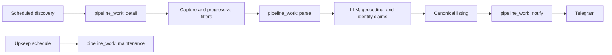

# Shoberfredy

Shoberfredy is a private, single-user homeserver application for finding
German rental listings, one job per search, any number of cities. It
discovers listings from ImmoScout24, Immowelt, Kleinanzeigen, and WG-Gesucht,
extracts structured facts with an LLM, deduplicates across portals and cities,
and sends accepted listings to Telegram.

It began as a fork of [Fredy](https://github.com/orangecoding/fredy) by
Christian Kellner (orangecoding) and keeps his copyright notice at the head of
every source file. The two have since diverged completely — the pipeline,
schema and deployment here are not upstream's — so
this repository is developed and released on its own. See [LICENSE](LICENSE) for
the terms, which include an attribution clause; the notices are required, not
decorative.

This README is the only document in the repository. Anything that needed saying
beside the code is said here instead.

## Three levels

One central pipeline serves many providers and many jobs, and each job is
fully self-describing. There are exactly three levels, and configuration
lives at exactly one of them:

| Level              | Holds                                                                                                             | Configurable?      |
| ------------------- | ------------------------------------------------------------------------------------------------------------------ | ------------------- |
| **Deployment**      | secrets, proxy URL, kill switches, timeouts, and every other tuning knob (`env`); `sqlitepath` (`config.json`) | yes                 |
| **Portal adapter**  | how to read one site: selectors, `normalize`, `captureDetails`, pagination                                        | no — code only      |
| **Job**             | everything about one search: city, cadence, filters, providers, notification | yes                 |

A portal adapter (`lib/provider/*.js`) never carries per-job state. Its
`init(sourceConfig)` is a pure builder: it returns a fresh config object
carrying that job's URL, so two jobs discovering the same portal concurrently
never see each other's search. Nothing about one job's configuration is
stored where another job's code would read it — the same principle that keeps
one job's blacklist from leaking into another's, applied to the adapter layer
too.

## Architecture



Discovery cadence is each job's own — `interval` and `workingHours` live on the
job document, not on one deployment-wide setting. One central scheduler ticks
every `FREDY_SCHEDULER_TICK_MS` and checks due-ness per `(job, provider)` pair
against a persisted `job_provider_schedule` row, so a restart does not
stampede every pair into running at once. Same-cadence jobs land at different
minutes: each pair gets a deterministic phase offset from a hash of its own
`(job, provider)` key, modulo its interval. A provider is one lane — at most
one discovery in flight per portal, plus a minimum gap
(`FREDY_DISCOVERY_MIN_PORTAL_GAP_MS`) between consecutive hits of it — while
different portals run concurrently under a global cap
(`FREDY_DISCOVERY_CONCURRENCY`). A pair that slips past several due windows
while waiting for a lane still only runs once, not once per window missed.

Detail capture, parsing, notification, and database upkeep are work kinds in
one durable queue. Each item has one shared lease, retry, terminal-state, and
audit contract. Process restarts reclaim expired work rather than running
repair scripts. Dedupe and filtering are pipeline stages, not maintenance
commands.

Retry budgets exist only where retry is the sole recovery path. Discovery has
none — a failed run simply waits for the next interval. `liveness` and
`maintenance` get one attempt each, because a maintenance pass or the next
interval re-enqueues them anyway. `detail`, `parse` and `notify` keep real
budgets: an unchanged card is only touched rather than reset, and a notification
is keyed forever, so nothing else would bring them back.

### One advert, one extraction, one verdict per job

Work is keyed by advert, not by (job, advert). Three searches that all find the
same flat meet at the same `pipeline_work` row, so it is fetched once and given
to the LLM once. What differs per job is the _verdict_, and that is a row in
`listing_verdicts` — so a flat inside one search's polygon and outside another's
is accepted by the first and rejected by the second, without either one hiding
or reviving the listing on the other's behalf.

Every stage asks the same question before it spends anything: has this advert
already been decided, under this job's configuration, on evidence that has not
changed? The answer is stored against the advert's identity claims and is
consulted at discovery, at detail capture, before the LLM call, and before
notification.

Filtering is deliberately uneven, because the stages differ in what they cost:

| Stage      | Filters on                                                                | Costs        |
| ---------- | ------------------------------------------------------------------------- | ------------ |
| Card       | The job's blacklist and specification, over what the card states           | nothing      |
| Extraction | The job's intent filter and specification, and geography from the address  | one LLM call |

The two lists are different kinds of thing and both belong to the job. The
blacklist is free text and only ever read at the card stage, where free text is
all there is. The intent filter is codes from a closed vocabulary — `swap`,
`wg_room`, `sublet`, `furnished`, `relisting_platform`, `fixed_term` — read only
after extraction, against validated enum fields the model already filled in.

There is still no text matching after extraction. The model answers "is this a
swap, a sublet, a WG room, furnished, fixed-term?" directly, and grepping the
page for the same thing asks twice and believes the worse answer. What changed is
that the answer is compared against a list the job owns rather than inferred from
whichever words happened to be in one deployment-wide blacklist: a search for a
WG room and a search for a whole flat want opposite verdicts on the same field,
and one list cannot hold both.

An advert refused at the card stage never becomes a listing. It is recorded in
`source_rejections` together with the claims that identify it, which is what
stops it being fetched and refused again on the next capture whose page text
differs.

Geography is decided exactly once, after extraction, from the address the model
read. Roughly a third of geocodes resolve only to a district or postcode
centroid, so a polygon decision is accurate to a neighbourhood rather than a
building. That is accepted deliberately: the alternative is guessing from the
scraped card, which is worse evidence for the same answer.

A job with no `spatialFilter` has no area limit, and then the geography of a
listing decides nothing about its verdict — the polygon test and the
`no_coordinates` refusal are both skipped rather than passed.

### One city, one market

Adverts routinely give a street and no city, and a German street name matches in
a hundred towns. So a job names the city it searches. That city anchors the
geocoder's fallback candidates and, folded to a stable key such as `München` to
`muenchen`, isolates provider health and listing identity across cities.

A listing's market is read from the locality the geocoder returned, not from the
job that found it, because a Munich search can still surface a flat one town
over. A listing that resolves to no city keeps a null market. This geographic
key is listing data; it is not a price score.

## Data policy

The SQLite schema has one current migration:
`lib/services/storage/migrations/sql/100.current-schema.js`. It creates a clean
database from scratch and is re-applied whenever its checksum changes, so it must
stay idempotent — everything it does is `IF NOT EXISTS` or guarded by a shape
check. Its cleanup steps remove what this deployment no longer has, including
the users and session tables from when Fredy shipped a web UI and the retired
price-model tables. Foreign keys are suspended while it runs, because dropping
a constrained column means rebuilding the table.

- `listings` holds extractions only. A listing exists once the LLM has read the
  advert; what each job decided about it is a `listing_verdicts` row, and an
  advert refused before extraction is a `source_rejections` row instead.
- A listing that stops being advertised becomes `gone`. Scheduled maintenance
  re-fetches the oldest still-active listings; the probe is a page fetch and
  nothing else, so confirming a flat is still up costs no LLM call.
- A job carries everything about one search: its city, its cadence (`interval`,
  `workingHours`), its providers (each with an optional per-provider
  `maxPages`), its notification target, its blacklist, its intent filter, its
  spatial filter and its specification. Nothing about one search is stored
  where another search would read it, and there is no read-time inheritance
  from a deployment-wide default.
- The provider circuit breaker (`provider_breaker_state`) is keyed by
  `(provider, market)`, not by provider alone — a portal blocking one city's
  search pauses discovery for that city only, not for every other city
  searching the same portal.
- `pipeline_work.status` is lifecycle only. What became of an item is `outcome`,
  why is `outcome_code` from a closed vocabulary, and `last_error` holds an
  exception message or nothing at all.
- `listing_texts` permanently keeps one richest full-text capture per listing.
  Transient queue copies are cleared after the listing reaches a terminal
  state.
- Listing images are converted to WebP, capped at 20 KB, named by SHA-256, and
  shared by content. Scheduled maintenance removes files no database row
  references.
- Source observations and LLM calls retain hashes, byte counts, outcomes, and
  timing rather than duplicating raw pages, prompts, or responses.
- Source URLs, filter decisions, processing attempts, merges, and notification
  results remain auditable. Scoring audit events and queue rows left behind by
  the retired price model are not history worth keeping, and a deployment that
  still carries them can delete them.
- There is no backfill or repair pipeline. Terminal work payloads are compacted
  automatically after their durable result is attached.

The upgrade preserves the existing database file. Set `FREDY_DB_VACUUM=1` to
let scheduled maintenance return freed SQLite pages to the filesystem.

## Docker

```bash
docker run -d --name shoberfredy \
  --env-file .env.local \
  -v shoberfredy_conf:/conf \
  -v shoberfredy_db:/db \
  -p 9998:9998 \
  ghcr.io/jhytabest/shoberfredy:main
```

The only HTTP surface is the health endpoint, on `FREDY_HEALTH_PORT` (default
`9998`, read once at startup) at <http://localhost:9998/health>; listings are
delivered through Telegram. Besides liveness it reports, without either being
able to fail a deploy, how long ago each provider last returned listings and
the data-integrity verdict scheduled maintenance last recorded.
The image runs as UID/GID `10001`; the supplied Compose file also uses a
read-only root filesystem, drops Linux capabilities, and enables
`no-new-privileges`.

The database lives at `/db/listings.db` and content-addressed media at
`/db/media`. Back up the two together.

### Required secrets

Place these in `.env.local`:

```dotenv
OPENROUTER_API_KEY=...
GOOGLE_GEOCODING_API_KEY=...
```

The application also reads `/conf/config.json`; its only deployment-level
setting is the SQLite directory:

```json
{ "sqlitepath": "/db" }
```

## Runtime controls

Every environment variable the application reads is declared in
`lib/shared/env.js`. Reading an undeclared name throws, so nothing is read
outside that registry — but the table below is hand-maintained alongside it,
not generated from it; keep the two in sync when the registry changes.

#### Credentials

| Variable                   | Default   | Purpose                                   |
| -------------------------- | --------- | ----------------------------------------- |
| `GOOGLE_GEOCODING_API_KEY` | `(unset)` | Google Geocoding key.                     |
| `OPENROUTER_API_KEY`       | `(unset)` | OpenRouter key; required for LLM parsing. |

#### Kill switches

| Variable                     | Default | Purpose                                            |
| ---------------------------- | ------- | -------------------------------------------------- |
| `FREDY_DETAIL_FETCH_ENABLED` | `true`  | Set 0 to stop draining detail work.                |
| `FREDY_LLM_ENABLED`          | `true`  | Set 0 to disable the LLM entirely (parsing stops). |
| `FREDY_MAINTENANCE_ENABLED`  | `true`  | Set 0 to stop scheduled maintenance work items.    |
| `FREDY_NOTIFICATION_ENABLED` | `true`  | Set 0 to stop notification delivery.               |
| `FREDY_PARSER_ENABLED`       | `true`  | Set 0 to stop the LLM parser worker.               |

#### Discovery scheduler

| Variable                           | Default  | Purpose                                                                                                                 |
| ----------------------------------- | -------- | ------------------------------------------------------------------------------------------------------------------------ |
| `FREDY_SCHEDULER_TICK_MS`          | `15000`  | How often the scheduler checks for due jobs.                                                                           |
| `FREDY_DISCOVERY_CONCURRENCY`      | `3`      | Global cap on discovery runs in flight at once, across all portals.                                                    |
| `FREDY_DISCOVERY_MIN_PORTAL_GAP_MS`| `5000`   | Minimum gap between consecutive discovery hits of the same portal, across jobs.                                        |
| `FREDY_DISCOVERY_MAX_PAGES`        | `20`     | Deployment-wide page-ceiling override, under a job's own `provider[].maxPages`; unset uses the adapter's own limit (3). |
| `FREDY_DISCOVERY_TIMEOUT_MS`       | `120000` | Deadline for one provider discovery run.                                                                               |
| `FREDY_HEALTH_PORT`                | `9998`   | Port for the `/health` HTTP server; read once at startup.                                                              |

#### The work queue

| Variable                             | Default    | Purpose                                                          |
| ------------------------------------ | ---------- | ------------------------------------------------------------------ |
| `FREDY_DETAIL_ITEM_TIMEOUT_MS`       | `300000`   | Deadline for one detail capture.                                 |
| `FREDY_DETAIL_MAX_FAILURES`          | `8`        | Attempts before a detail item is abandoned.                      |
| `FREDY_PARSER_ITEM_TIMEOUT_MS`       | `300000`   | Deadline for one parse (text + repair).                          |
| `FREDY_PARSER_MAX_ITEM_FAILURES`     | `8`        | Attempts before a parse item is abandoned.                       |
| `FREDY_NOTIFICATION_ITEM_TIMEOUT_MS` | `120000`   | Deadline for one notification digest.                            |
| `FREDY_NOTIFICATION_BATCH_SIZE`      | `50`       | Deliveries considered for one digest.                            |
| `FREDY_MAINTENANCE_ITEM_TIMEOUT_MS`  | `1800000`  | Deadline for automatic database upkeep.                          |
| `FREDY_WORK_IDLE_POLL_MS`            | `1000`     | Idle sleep between empty work-queue polls.                       |
| `FREDY_WORK_MAX_BACKOFF_MS`          | `900000`   | Ceiling on retry and park backoff for work items.                |
| `FREDY_WORK_MAX_DEFERRALS`           | `24`       | Parks on a resource before work is abandoned.                    |
| `FREDY_WORK_MAX_PARK_MS`             | `86400000` | Age at which parked work is abandoned regardless of park count.  |
| `FREDY_NOTIFY_MAX_FAILURES`          | `6`        | Attempts before a notification is abandoned.                     |
| `FREDY_WORKER_RESTART_DELAY_MS`      | `5000`     | Delay before restarting a crashed worker loop.                   |

#### LLM

| Variable                               | Default  | Purpose                                     |
| -------------------------------------- | -------- | ------------------------------------------- |
| `FREDY_LLM_DAILY_LIMIT`                | `1000`   | Daily LLM request budget (UTC days).        |
| `FREDY_LLM_MAX_EMBEDDED_CHARS`         | `24000`  | Cap on embedded JSON sent to the LLM.       |
| `FREDY_LLM_MAX_LISTING_FAILURES`       | `5`      | LLM attempts before a listing is abandoned. |
| `FREDY_LLM_MAX_TEXT_CHARS`             | `24000`  | Cap on captured page text sent to the LLM.  |
| `FREDY_LLM_REQUEST_TIMEOUT_MS`         | `120000` | Deadline for a single LLM request.          |
| `FREDY_LLM_TEXT_MODEL`                 | _unset_  | OpenRouter model id for text extraction.    |
| `FREDY_LLM_UPSTREAM_BACKOFF_MS`        | `60000`  | Backoff after an upstream LLM rate limit.   |
| `FREDY_OPENROUTER_REQUESTS_PER_MINUTE` | `18`     | Client-side OpenRouter rate limit.          |

#### Filters and geocoding

| Variable                                 | Default | Purpose                                                                                  |
| ---------------------------------------- | ------- | ---------------------------------------------------------------------------------------- |
| `FREDY_GEOCODER_RETRY_COARSE_AFTER_DAYS` | `14`    | Age at which a coarse geocode retries.                                                   |
| `FREDY_CARD_FILTER_AUDIT_RATE`           | `0.03`  | Fraction of card-stage refusals let through to extraction so the refusal can be checked. |

#### Provider circuit breaker

| Variable                                 | Default    | Purpose                                                                           |
| ---------------------------------------- | ---------- | --------------------------------------------------------------------------------- |
| `FREDY_PROVIDER_BREAKER_COOLDOWN_MS`     | `1800000`  | Initial provider pause duration.                                                  |
| `FREDY_PROVIDER_BREAKER_FAILURES`        | `2`        | Failed discovery runs before a provider is paused.                                |
| `FREDY_PROVIDER_BREAKER_ITEM_CHALLENGES` | `8`        | Challenged single requests, with no success between, before a provider is paused. |
| `FREDY_PROVIDER_BREAKER_MAX_COOLDOWN_MS` | `21600000` | Ceiling on provider pause.                                                        |

#### Maintenance

| Variable                         | Default     | Purpose                                                                      |
| -------------------------------- | ----------- | ---------------------------------------------------------------------------- |
| `FREDY_DB_VACUUM`                | `false`     | Set 1 to VACUUM during scheduled maintenance.                                |
| `FREDY_MAINTENANCE_INTERVAL_MS`  | `86400000`  | Spacing between maintenance work items.                                      |
| `FREDY_LIVENESS_CHECKS_PER_PASS` | `200`       | Stale listings re-fetched per pass to see whether they are gone. 0 disables. |
| `FREDY_LIVENESS_STALE_AFTER_MS`  | `604800000` | Age at which an active listing is re-checked for liveness.                   |

#### Runtime and tooling

| Variable                          | Default       | Purpose                                                         |
| --------------------------------- | ------------- | --------------------------------------------------------------- |
| `CLOAKBROWSER_BINARY_PATH`        | _unset_       | Explicit CloakBrowser Chromium path.                            |
| `CLOAKBROWSER_CACHE_DIR`          | _unset_       | CloakBrowser download cache directory.                          |
| `FREDY_DOCKER`                    | `false`       | Set by the container image to signal a Docker deployment.       |
| `FREDY_PROXY_URL`                 | _unset_       | HTTP proxy used when reachable; unavailable proxies are bypassed. |
| `MIGRATION_ALLOW_CHECKSUM_UPDATE` | `false`       | Permit rewriting the recorded checksum of an applied migration. |
| `NODE_ENV`                        | `development` | Node environment; "production" quiets debug logging.            |

## Local development

Node.js 22 or newer is required.

```bash
yarn install
yarn start:backend
```

Quality checks:

```bash
yarn format:check
yarn lint
```

CI checks the application, builds the Docker image, starts it through the real
migration path, and requires a healthy `/health` response before publishing.

There is no test suite, and none should be added unless it is asked for.
Verification here means running the real path against a production snapshot —
see the Docker mirror below.

Source files carry no comments beyond the licence header. Two exceptions are
kept because they are directives rather than prose: `eslint-disable` markers,
and a comment that is the entire body of an otherwise-empty block, which
`no-empty` requires.

## Production-state Docker mirror

The live database can be snapshotted into `db/listings.db` without stopping or
writing to production:

```bash
tools/mirror-live.sh
```

It runs `VACUUM INTO` inside the live container over SSH — a plain file copy of a
WAL-mode database silently drops whatever is still in the write-ahead log — then
downloads the result and removes the remote temporary file. The source is opened
read-only. Set `SHOBERFREDY_MIRROR_HOST` (default `hs`) and
`SHOBERFREDY_MIRROR_CONTAINER` (default `fredy`) to point it elsewhere.

This is the only place a schema change is exercised against real data. CI builds
the image and requires a healthy `/health`, but it does so against an empty
database, so it validates migration-from-scratch and nothing else.

```bash
tools/mirror-live.sh                       # snapshot production
cp db/listings.db ~/pre-migration.db       # before anything destructive
yarn migratedb                             # the real migration path
yarn maintenance status                    # exit 0 == healthy
```

The snapshot contains durable state, not process memory, open connections, or
in-flight requests.

## Maintenance

Database upkeep runs automatically as durable pipeline work. The operator
commands are a read-only health report, a settings editor, and a job editor:

```bash
yarn maintenance status
yarn maintenance settings list
yarn maintenance jobs list
```

`status` checks the migration ledger, SQLite integrity, foreign keys, queue
state, claim coverage, audit relationships, and full-text coverage. Dedupe,
payload compaction, orphan-media cleanup, terminal work-row pruning, and optional
vacuuming have no manual mutation path.

`settings` remains the only write path into the legacy `settings` table. The
application no longer reads proxy configuration from it; use
`FREDY_PROXY_URL` instead.

`jobs` is the only write path into the `jobs` table. Every document is validated
before it is stored — provider ids against the loaded providers, intent codes
against the closed vocabulary, `notify` fields against what Telegram needs,
`spatialFilter` against carrying an actual polygon — because a filter the
pipeline cannot read is worse than no filter: the search keeps running without
it. `jobs list` and `jobs show` redact `notify.token`, since it stays in the
database.

```bash
yarn maintenance jobs list
yarn maintenance jobs show <id>
yarn maintenance jobs add '<json-document>'
yarn maintenance jobs set <id> specFilter '{"maxPrice":900}'
yarn maintenance jobs patch <id> '{"blacklist":["Tausch"],"intentFilter":["swap"]}'
yarn maintenance jobs disable <id>
yarn maintenance jobs remove <id>
```

A job document looks like this — everything about one search, with no
deployment-wide default left to inherit. `spatialFilter: null` means no area
limit, `workingHours` empty means no time-of-day limit, and several provider
entries may share an id when one portal needs more than one search URL:

```json
{
  "name": "München",
  "city": "München",
  "interval": 15,
  "workingHours": { "from": "", "to": "" },
  "provider": [{ "id": "wgGesucht", "url": "https://www.wg-gesucht.de/...", "maxPages": 3 }],
  "notify": { "token": "...", "chatId": "-100...", "threadId": null, "plainText": false },
  "blacklist": ["Tausch"],
  "intentFilter": ["swap", "relisting_platform"],
  "specFilter": { "maxPrice": 900 },
  "spatialFilter": null
}
```

`interval` and `workingHours` are cadence, not decision — editing them does not
change `config_hash` or re-decide anything. Editing a job's filters
(`blacklist`, `intentFilter`, `specFilter`, `spatialFilter`) does change its
`config_hash`, so the adverts it has already decided are re-decided against
the new configuration on the next pass. That costs no LLM calls: extraction is
keyed by advert and is already stored.

The scheduled pass records its verdict, and `/health` serves that recorded
verdict with its age rather than recomputing an integrity check on every liveness
probe — the two surfaces report one answer about one database. Finished work rows
are pruned after 30 days; anything still pending, retrying or leased is never
touched. Orphaned media are images no `listing_images` row references, so the
first pass after a long gap can remove a great deal at once.

## Provider notes

ImmoScout uses its mobile API. The other providers use CloakBrowser. On a
datacenter host, a German residential proxy may be needed; configure its HTTP
URL with `FREDY_PROXY_URL`, for example:

```text
http://host:port
```

Leave the variable empty to connect directly. Fredy checks the proxy with an
HTTP CONNECT probe and uses it globally only while it is reachable; changing
the variable requires a container restart.

Immowelt declares `requiresProxy` in its provider metadata, so it is the one
provider that will not run without one: on a bare datacenter IP it answers every
search with an HTTP 403 bot challenge and no cards, which is indistinguishable
from changed markup and drives the circuit breaker to its six-hour ceiling.
While the configured proxy is unreachable, discovery skips Immowelt and
already-queued Immowelt detail captures wait rather than spending their failure
budget. Both resume automatically after the proxy recovers, while providers
that do not require it continue directly.
